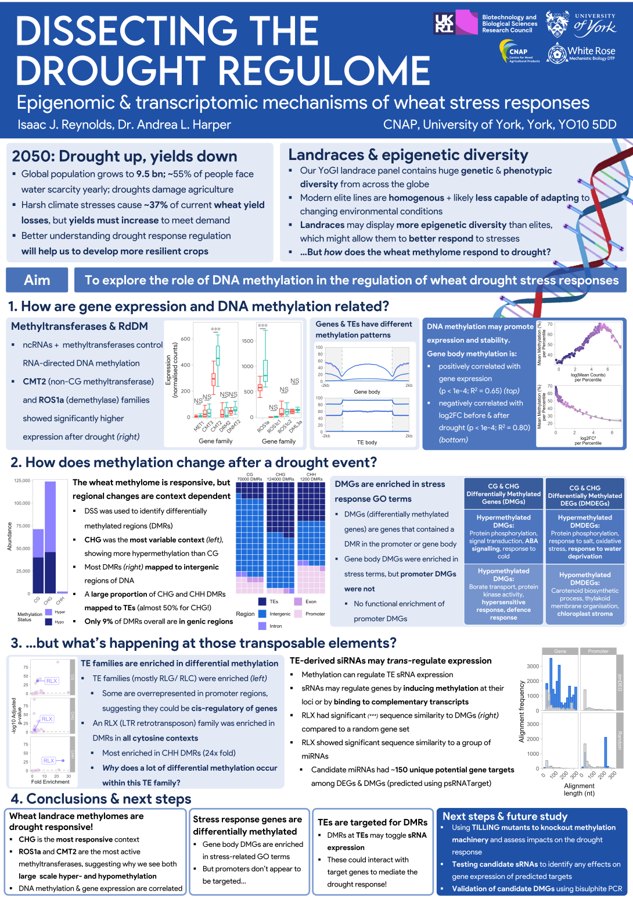

### Publications

🌾 [Transcriptomic and co-expression network analyses on diverse wheat landraces identifies candidate master regulators of the response to early drought ](https://doi.org/10.3389/fpls.2023.1212559)
Liam J. Barratt &  Isaac J. Reynolds, Sara Franco Ortega, Andrea L. Harper

🫛 [The Perennial Horse Gram (Macrotyloma axillare) Genome, Phylogeny, and Selection Across the Fabaceae ](https://link.springer.com/chapter/10.1007/978-3-031-00848-1_14)
David Fisher, Isaac Reynolds & Mark A. Chapman 

### Data visualisations

[content will go here! ]

### Posters

  **Cologne Spring Meeting (2025)**  

